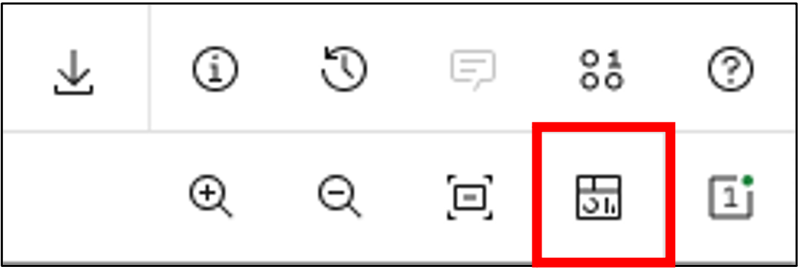
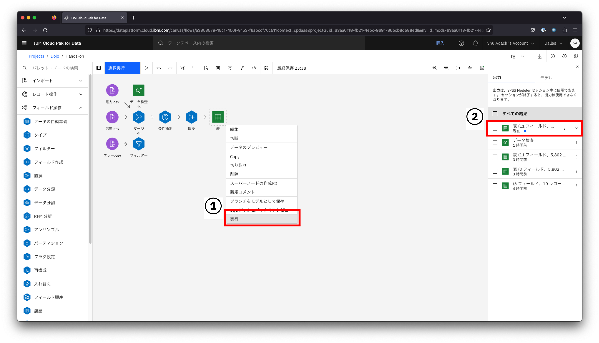
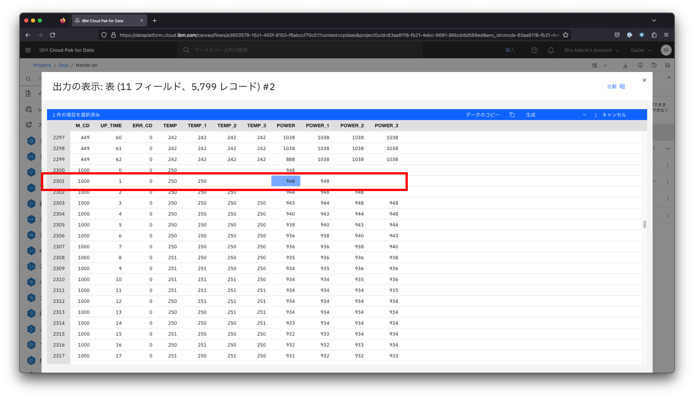
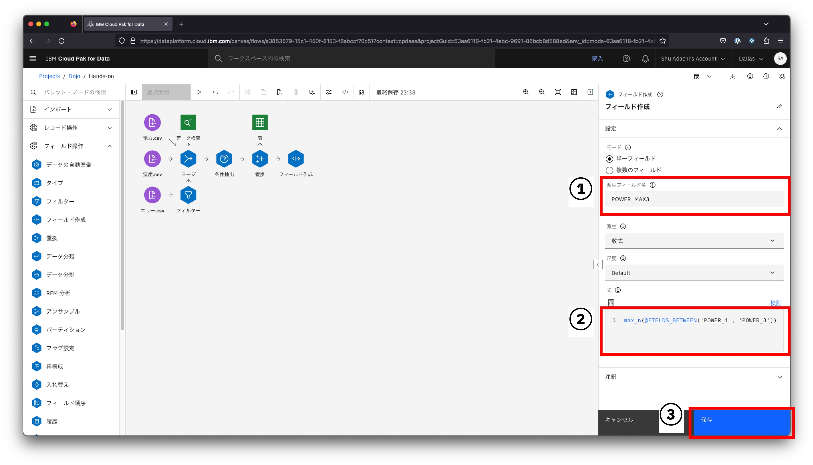
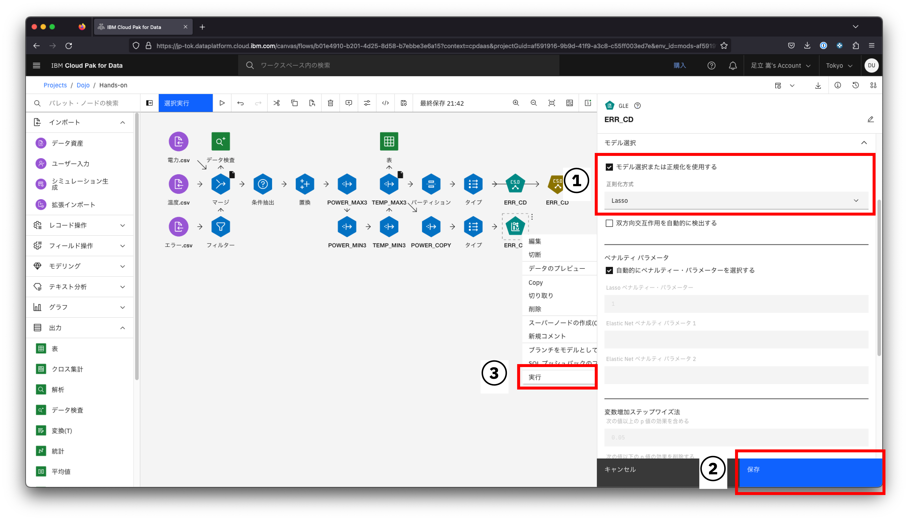

# 故障予知

本ハンズオンでは、とある工場に配置されたマシンから取得した稼働データ(起動時間ごとの消費電力・温度・エラーコード)を使用し、故障予知をしてみます。</br>


本ハンズオンを通じて、1からこのストリーム([完成版ストリームファイル.str](./完成版ストリームファイル.str))を作成していきます。</br>


## 1. プロジェクトの作成

Watson Studioのホーム画面で、**プロジェクトの作成**をクリックします。</br>


プロジェクトの作成画面で、**空のプロジェクトを作成**をクリックします。</br>


新規プロジェクトの画面で、名前欄に**Dojo**を入力します。</br>
画像の様に**①ストレージ・サービスの選択**と表示されている場合は、「追加」がリンクとなっていますのでクリックしてください。</br>
**ストレージ**と表示され、ストレージ名が既に入力されている場合は、右下の**作成**をクリックし、以降のストレージ作成の手順はスキップしてください。</br>


Cloud Object Storageの作成画面が表示されたら、料金プランの中から、**ライトプラン**を選択し、**作成**をクリックします。</br>
※自動でプロジェクト作成画面に戻ります</br>


先ほどのプロジェクト作成画面でストレージ欄にストレージ名が入っていることを確認して、**作成**をクリックします。</br>


以下の様にプロジェクトのホーム画面が表示されたら、プロジェクトの作成完了です。</br>


## 2. 資産の作成

**資産タブ**に切り替えて、**新規資産**をクリックします。</br>


新規資産画面が表示されたら、検索フィールドに`SPSS Modeler`と入力し、グラフィカルビルダーに表示される**SPSS Modeler**をクリックします。</br>


SPSS Modeler Flowの作成画面が表示されたら、以下の通り設定し**Create**をクリックします。</br>
|フィールド|設定値|
|:--|:--|
|Name|Hands-on|
|環境定義|Default SPSS Modeler S(2 vCPU 8GB RAM)|


少し待つと、SPSS Modeler Flowが利用できる様になります。</br>


## 3. データの読み込み

このリポジトリをダウンロードし、[dataフォルダ](./data)に入っている以下のCSVファイルをすべて画面右側の点線で囲まれた部分にドラッグ＆ドロップします。</br>
|ファイル名|
|:--|
|エラー.csv|
|エラー_予測.csv|
|温度.csv|
|温度_予測.csv|
|電力.csv|
|電力_予測.csv|


インポートパレットから、**データ資産**ノードをフロー・キャンバスにドラッグ＆ドロップします。</br>


データ資産ノードを**ダブルクリック**または、右クリックし**開く**をクリックします。</br>


データ資産の選択画面が表示されたら、**データ資産** > **電力.csv**と選択し、**条件抽出**をクリックします。</br>


**タイプ**セクションを選択します</br>
**値の読み込み**をクリックし、下の表に列名などが表示されたら**M_CD**の**指標**を**名義**に変更します。</br>
再度**値の読み込み**をクリックし、**保存**をクリックします。</br>


先ほど配置したノードの名前が**電力.csv**に自動で切り替わります。</br>


同様の手順で、**温度.csv**と**エラー.csv**をフロー・キャンバスに追加します。</br>
**温度.csv**の**指標**で変更するのは**M_CD**、</br>
**エラー.csv**の**指標**で変更するのは**マシンコード**と**ERR_CD**です。


> 余裕のある方は、任意のノードを右クリックして、**データのプレビュー**を選択してみてください。</br>
> 読み込んだデータの中身を画面上で確認することができます。</br>
> 

## 4. データ加工（列名変更）

用意されたデータの中身を確認すると、列名に揺らぎがあることが確認できます。</br>
後々、データを加工する際同じ列名の方が便利なため、列名を統一します。</br>


フィールド操作パレットから、**フィルター**ノードをフロー・キャンバスにドラッグ＆ドロップし、**エラー.csv　→　フィルター**と接続します。</br>


> **<font color="blue">ノード同士の接続方法</font>**</br>
> 接続元のノードにマウスカーソルを置くと、**＞マーク**が表示されます。</br>
> **＞マーク**をドラッグし接続先のノードの上で離すとノードの接続ができます。</br>
> 

フィルターノードを**ダブルクリック**または、右クリックし**編集**をクリックします。</br>
**出力フィールド**の**マシンコード**を**M_CD**、**起動時間**を**UP_TIME**に変更し、**保存**をクリックします。</br>


データの加工が意図した通りにできているか確認をします。</br>
出力パレットから、**表**ノードをフロー・キャンバスにドラッグ＆ドロップし、**フィルター →　表**と接続します。</br>


表ノードを右クリックし**実行**をクリックします。</br>
少し待つと、画面右側に出力の実行結果が表示されるので、一番上の出力結果をクリックします。</br>


> 実行結果は、右上にある赤枠のアイコンをクリックし、出力タブに切り替えることで確認できます。</br>
> 

列名が変換できました。</br>


## 5. データ加工（レコード結合）

3つのCSVファイルをマシンコードと起動時間をキーに1つのテーブルに結合します。</br>


レコード操作パレットから、**マージ**ノードをフロー・キャンバスにドラッグ＆ドロップし、</br>
**電力.csv　→　マージ**</br>
**温度.csv　→　マージ**</br>
**フィルター　→　マージ** (エラー.csvから接続しない様に注意)</br>
と接続します。</br>


マージノードを**ダブルクリック**します。</br>
マージ法に**キー**を選択し、**列の追加**をクリックします。</br>


**M_CDとUP_TIMEをON**にし、**OK**をクリックします。</br>
> それぞれの入力データに同じ名前のキー項目が含まれているので複数表示されていますが、どれを選んでも問題ありません。
> 自動で先頭のキー名がONになります。


**保存**をクリックします。</br>


再度、マージノードによって得られるデータが意図したものか確認するため、一度表ノードに出力します。</br>
ノードを使い回しするため、先ほど使用した**フラグ設定と表の接続を解除**してください。</br>

> **<font color="blue">ノードの接続解除方法</font>**</br>
> 削除したい接続(→)を右クリックし、**削除**をクリックすると接続が解除できます。</br>
> 

接続の解除ができたら、**マージ → 表**と接続します。</br>


表ノードを右クリックし**実行**をクリックします。</br>
少し待つと、画面右側に出力の実行結果が表示されるので、一番上の出力結果をクリックします。</br>


上手くM_CD, UP_TIMEをキーに3つのテーブルを結合できました。</br>


> マージは、キーとなる項目が必要です。</br>
> 各入力データでキーとなる項目名は同じである必要があります。</br>
> キー項目の名称が異なる場合は、先ほど実施した様にマージの前に項目名を変更するノード(フィルターノード)を使用します。</br>
> 例）マシンコード → M_CDなど

## (Option)キャッシュ

SPSSには**キャッシュ**と言う便利な機能が提供されています。</br>
基本的にはフローを実行すると、データの入力から出力まで全てのノードの処理が流れます。</br>
データ量が少ない場合には特に問題が表面化しにくいのですが、大量のデータを処理する場合、毎回データの入力から処理を実行するのは時間がかかるので、その対策としてキャッシュを利用します。</br>
任意のノードでキャッシュを有効にすると、1回目の処理結果をメモリ上に保持する様になり、2回目以降の実行時にはキャッシュからデータを取得してくれます。</br>


キャッシュを設定したいノードを右クリックし**cache > 有効にする**を選択します。</br>


キャッシュを有効にした直後は左側の白いアイコンが表示されます。</br>
白いアイコンはまだキャッシュにデータが保持されていないことを意味し、一度キャッシュにデータが保持されると右側の黒いアイコンに変更されます。</br>


## 6. データ視覚化（データ検査）

結合がひとまず出来た段階でデータの可視化を行い、欠損値があるか確認します。

出力パレットから、**データ検査**ノードをフロー・キャンバスにドラッグ＆ドロップし、**マージ　→　データ検査**と接続します。</br>


データ検査ノードを右クリックし実行をクリックします。</br>
少し待つと、画面右側に出力の実行結果が表示されるので、一番上の出力結果をクリックします。</br>


各項目のグラフ描画・基本的な統計量算出・欠損値の検査を網羅的に行い、想定外の値・分布・欠損値が確認できます。</br>
電力と温度に欠損値が存在することがわかったため、データを加工しましょう。</br>


## 7. データ加工（条件抽出）

欠損値を含む温度(データとしては3行)を使用するデータから除外します。

レコード操作パレットから、**条件抽出**ノードをフロー・キャンバスにドラッグ＆ドロップし、</br>
**マージ → 条件抽出**</br>
**条件抽出 → 表**</br>
と接続し直します。</br>


> **<font color="blue">ノードの割り込み方法</font>**</br>
> 既存の接続間にノードを追加したい場合、→の上に追加したいノードをドラッグ＆ドロップすることで簡単に追加することができます。</br>
> 

条件抽出ノードを**ダブルクリック**します。</br>
式の下にあるアイコンをクリックし、欠損値を除外する式を作成します。</br>


式ビルダーが表示されたら、**フィールド**をクリックし、式を手入力するか以下の手順で作成し、**OK**をクリックします。</br>

1. **TEMP**をダブルクリック
2. **/=**をクリック
3. `'$null$'`(半角・小文字)を入力


> 式が下記画像の状態になっていることを確認してください。</br>
> </br>
> 違っていた場合、以下の式へ修正してください。</br>
> ```text
> TEMP /= '$null$'
> ```

**保存**をクリックします。</br>


表ノードを右クリックし実行をクリックします。</br>
少し待つと、画面右側に出力の実行結果が表示されるので、一番上の出力結果をクリックします。</br>


5802レコードの中から3レコード除外したため、5799レコードが取得できました。</br>


> 今回は省きますが、データ検査ノードを条件抽出ノードに再接続して、本当に欠損値を含むレコードを除外できているか確認すると良いでしょう。

## 8. データ加工（置換）

欠損値を含む電力(データとしては1行)を1つ前のデータを利用して置換します。

フィールド操作パレットから、**置換**ノードをフロー・キャンバスにドラッグ＆ドロップし、</br>
**条件抽出 → 置換**</br>
**置換 → 表**</br>
と接続し直します。</br>


置換ノードを**ダブルクリック**し、**列の追加**をクリックします。</br>


**POWER**をクリックし、**OK**をクリックします。</br>


**置換**は**NULL値**を選択し、**置換文字列**には以下の式を入力します。

```text
if @OFFSET(M_CD,1) = M_CD then
 @OFFSET(POWER,1)
else
 0
endif
```

**保存**をクリックします。</br>


> この手順で追加した条件式は、1行前のマシンコードを参照(@OFFSET(M_CD,1))して、自分と同じマシンコードなら1行前の電力(@OFFSET(POWER,1))に置換し、異なる場合は0に置換します。

表ノードを右クリックし実行をクリックします。</br>
少し待つと、画面右側に出力の実行結果が表示されるので、一番上の出力結果をクリックします。</br>


マシンコード1000番の1秒時点の部分が欠損値だったため、値が置換されていることを確認します。</br>


> 余裕のある方は、置換前(条件抽出ノードまで)のデータを表に出力して、マシンコード1000番のPOWER列を確認してみてください。
> 今回置換した1秒時点のデータが空白(null)になっていることが確認できます。

## 9. データ加工（特徴量抽出）

生データから、予測に役立つ特徴量を抽出します。</br>
適切なデータを利用して適切な特徴量を設定することが、予測分析の精度を向上するための最も有効な方法です。</br>
今回は各行に直近3秒分の電力と温度をすでに持っているので、このデータを利用して、その中の最大値・最小値を算出します。</br>


フィールド操作パレットから、**フィールド作成**ノードをフロー・キャンバスにドラッグ＆ドロップし、**置換 → フィールド作成**と接続します。</br>


フィールド作成ノードをダブルクリックし、派生フィールド名に生成する列名として**POWER_MAX3**と入力します。</br>
式にPOWER_1~POWER_3の中の最大値を取得する以下の式を入力します。</br>

```text
max_n(@FIELDS_BETWEEN('POWER_1', 'POWER_3'))
```

**保存**をクリックします。</br>


同様の手順で電力の最小値も作成します。</br>

フィールド操作パレットから、**フィールド作成**ノードをフロー・キャンバスにドラッグ＆ドロップし、**POWER_MAX3 → フィールド作成**と接続します。</br>
フィールド作成ノードをダブルクリックし、派生フィールド名に生成する列名として**POWER_MIN3**と入力します。</br>
式にPOWER_1~POWER_3の中の最小値を取得する以下の式を入力します。</br>

```text
min_n(@FIELDS_BETWEEN('POWER_1', 'POWER_3'))
```

**保存**をクリックします。</br>


温度の最大値と最小値も作成します。</br>

POWER_MAX3とPOWER_MIN3を選択し、コピー＆ペーストします。</br>


> **<font color="blue">ノードの範囲選択方法</font>**</br>
> キーボードのShiftキーを押すとノードを範囲選択できます。</br>
> 

(コピー元の)POWER_MIN3 → (コピー先の)POWER_MIN3と接続します。


(コピー先の)POWER_MIN3をダブルクリックし、派生フィールド名に生成する列名として**TEMP_MIN3**と入力します。</br>
式にTEMP_1~TEMP_3の中の最小値を取得する以下の式を入力します。</br>

```text
min_n(@FIELDS_BETWEEN('TEMP_1', 'TEMP_3'))
```

**保存**をクリックします。</br>


(コピー先の)POWER_MAX3をダブルクリックし、派生フィールド名に生成する列名として**TEMP_MAX3**と入力します。</br>
式にTEMP_1~TEMP_3の中の最大値を取得する以下の式を入力します。</br>

```text
max_n(@FIELDS_BETWEEN('TEMP_1', 'TEMP_3'))
```

**保存**をクリックします。</br>


表ノードをTEMP_MAX3に接続し直し、右クリックし実行をクリックします。</br>
少し待つと、画面右側に出力の実行結果が表示されるので、一番上の出力結果をクリックします。</br>


直近3秒分の電力と温度の最大値・最小値が算出できました。</br>


これでデータの加工は完了です。</br>
ここまでのキャッシュもTEMP_MAX3に設定しておきましょう。</br>

## 10. モデル作成(決定木)

教師あり学習の一種である、決定木を用いて予測モデルを作成します。</br>
エラーの確度が高いグループと低いグループに分岐していき、最終的に樹木の様に枝分かれした樹形図を作成します。</br>

フィールド操作パレットから、**パーティション**ノードをフロー・キャンバスにドラッグ＆ドロップし、**TEMP_MAX3　→　パーティション**と接続します。</br>


フィールド操作パレットから、**タイプ**ノードをフロー・キャンバスにドラッグ＆ドロップし、**パーティション　→　タイプ**と接続します。</br>


タイプノードをダブルクリックし、**値の読み込み**をクリックします。</br>
ロールを以下の通り設定して**保存**をクリックします。</br>
|フィールド|ロール|
|:-|:-|
|M_CD|なし|
|UP_TIME|なし|
|ERR_CD|対象|
|データ区分|パーティション|
|上記以外|入力|

> タイプノードで設定したロールは、モデルのルールに対して以下の様な意味を持ちます。</br>
> |ロール|説明|
> |:-|:-|
> |両方|前提条件と結果両方の候補|
> |入力|前提条件の候補|
> |対象|結果の候補|

モデル作成パレットから、**C5.0**ノードをフロー・キャンバスにドラッグ＆ドロップし、**タイプ → C5.0**と接続します。</br>
C5.0ノード(ノード名がERR_CDになっています)を右クリックし、**実行**をクリックします。</br>


C5.0のモデルナゲットが生成されたら、右クリックし**モデルの表示**をクリックします。</br>


モデルの詳細が表示されたら、**特徴量の重要度**を選択します。</br>
この画面では、作成したモデルでエラーコードを予測する際に重要となる列(今回はTEMPが多くを占める)を示しています。</br>
もし、上位に予測に関係がないと思われる列が入っている場合は、先ほどのタイプノードのロールを**なし**に変更してモデルを再作成します。


次に、**ツリー図**を選択します。</br>
赤枠で囲った部分は、**温度が253.5〜259.5かつ電力が863.5以下の場合、303のエラーが発生する**ルールを示しています。</br>


## 11. モデル作成(Lasso回帰)

本ハンズオンでは列数が少ないため、人力で列の要不要が判断できますが、数百以上の列を含むデータを利用する際はそうはいきません。</br>
そこで不要と考えられる列を洗い出せる便利なノードを紹介します。</br>
わかりやすい様に、今回は全く同じ意味を持つ列を1つ作成し動作を確認しましょう。</br>

フィールド操作パレットから、**フィールド作成**ノードをフロー・キャンバスにドラッグ＆ドロップし、**TEMP_MAX3　→　フィールド作成**と接続します。</br>
フィールド作成ノードをダブルクリックし、派生フィールド名に**POWER_COPY**、式に**POWER**を入力し、**保存**をクリックします。


フィールド操作パレットから、**タイプ**ノードをフロー・キャンバスにドラッグ＆ドロップし、**POWER_COPY　→　タイプ**と接続します。</br>
タイプノードをダブルクリックし、**値の読み込み**をクリックします。</br>
ロールを以下の通り設定して**保存**をクリックします。</br>

|フィールド|ロール|
|:-|:-|
|M_CD|なし|
|UP_TIME|なし|
|ERR_CD|対象|
|上記以外|入力|


モデル作成パレットから、**GLE**ノードをフロー・キャンバスにドラッグ＆ドロップし、**タイプ → GLE**と接続します。</br>


GLEノード(ノード名がERR_CDになっています)をダブルクリックします。</br>
**モデル選択**を開き、**モデル選択または正則化を使用する**のチェックを**ON**にし、**保存**をクリックします。</br>
GLEノードを右クリックし、**実行**をクリックします。</br>


GLEのモデルナゲットが生成されたら、右クリックし**モデルの表示**をクリックします。</br>


モデルの詳細が表示されたら、**パラメーター推定値**を選択します。</br>
先ほど作成した不要な列**POWER_COPY**を確認すると、使用されていないことがわかります。</br>
分析の際にどの列を採用すれば良いかわからない場合はまずはこのLasso回帰を試してみても良いでしょう。</br>


## 12.　学習とテスト

作成した予測モデルの予測精度を検証します。</br>
パーティションノードによって実績データの一部を学習用に、残りをテスト用に分割して実施します。</br>


出力パレットから、**解析**ノードをフロー・キャンバスにドラッグ＆ドロップし、**ERR_CD →　解析**と接続します。</br>


解析ノードをダブルクリックし、**一致行列**のチェックを**ON**にして、**保存**をクリックします。</br>


解析ノードを右クリックし、**実行**をクリックします。</br>
少し待つと、画面右側に出力の実行結果が表示されるので、一番上の出力結果をクリックします。</br>


学習・テストの両方に対して、正答率などを表示できます。</br>
目標としている精度を達成しているかや、過学習（学習データに対しては予測精度が高いのに、テストデータに対しては精度が低いこと）が発生していないかの確認ができます。</br>


## 13.　予測ステップ

学習ステップで行ったデータ加工と同じ処理を予測データに対して実施します。</br>

データの読み込みステップと同様の手順で、**電力_予測.csv**と**温度_予測.csv**と**エラー_予測.csv**をフロー・キャンバスに追加します。</br>


学習ステップから、赤枠で示したノード(フィルター・マージからTEMP_MAX3まで)をまとめてコピー＆ペーストします。</br>


**電力_予測.csv → マージ**、**温度_予測.csv → マージ**、**エラー.csv → フィルター**と接続します。</br>


先ほどと同様に学習ステップから、C5.0のERR_CDモデルナゲットをコピー＆ペーストし、**TEMP_MAX3 → ERR_CD**と接続します。</br>


出力パレットから、**表**ノードをフロー・キャンバスにドラッグ＆ドロップし、**モデルナゲット　→　表**と接続します。</br>


表ノードを右クリックし、**実行**をクリックし予測結果を見てみます。</br>


予測用として渡したデータに対して、その時点で発生するだろうと予想されるエラーコードとその確度を提示しています。</br>
今回使用したデータでは「63〜65秒は98％くらいの確率でエラーは発生しないが、66秒目の電力・温度が上昇しているタイミングからは98％くらいの確率で202のエラーが発生する。」と言う結果が得られました。</br>

> 予測結果はモデルによって自動で命名された列が追加されます。
> 予測結果は画面への表示だけでなく、ファイルやRDBへの書き出しや作成したモデルを保存しアプリケーションから実行することも可能です。


以上で本ハンズオンは終了です。お疲れ様でした。
